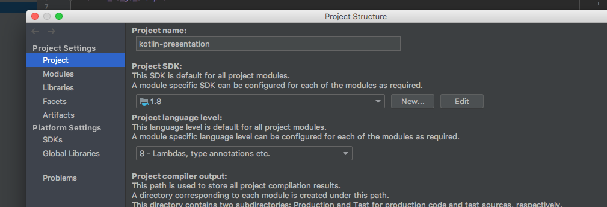

# running:
### import

open project in intellij pointing to `build.gradle` file and select `open as project`.

# kotlin_vs_go_example

### building:

```
./gradlew build
```

### Running:

Easier to run from IntelliJ if you have java and go installed:


Just Run either `main/presentation_run.go`, `src/main/kotlin/main/no_warmup.kt` or `src/main/kotlin/main/with_warmup.kt`
